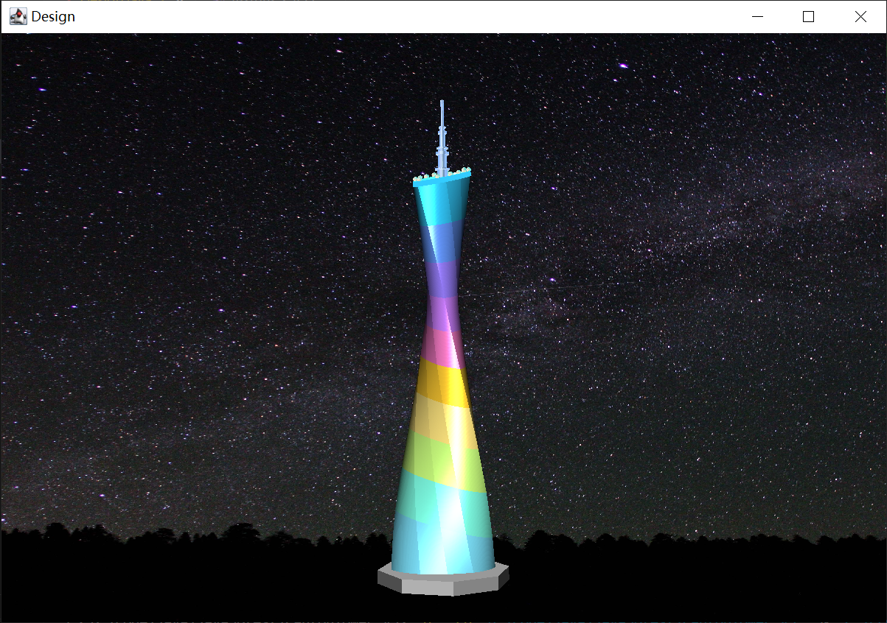

# Canton_Tower
 Java3D Design: Canton Tower. The famous landmark building Canton Tower was designed with Java3D. Using the method of cubic Bezier surface splicing, the tower body has the effect of rotation.

 
